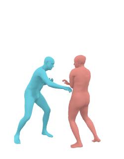
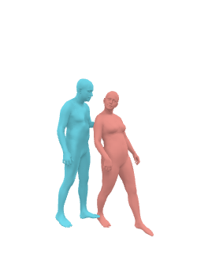

# BUDDI
<b> Generative Proxemics: A Prior for 3D Social Interaction from Images </b>\
[[Project Page](some.url)] [[arXiv](some.url)]


## In this repo you will find ...

... [BUDDI](#buddi-inference), a diffusion model that learned the joint distribution of two people in close proxeminty. BUDDI directly generates [SMPL-X](https://smpl-x.is.tue.mpg.de) body model parameters for two people.

... [Optimization with BUDDI](#optimization-with-buddi), we use BUDDI as a prior during optimization via an SDS loss inspired by [DreamFusion](https://arxiv.org/pdf/2209.14988.pdf). This approach does not require ground-truth contact annotations.

... [FlickrCI3D PGT](#optimization-with-ground-truth-contact-maps), we use ground-truth contact annotations to create pseudo ground-truth fits for [FlickrCI3D](https://ci3d.imar.ro).

## Release status

| BUDDI inference | BUDDI training | Smplify-X2P | FlickrCI3D PGT |
| :----: | :----: | :----: | :----: |
| &check; | &check;  | &check; | &cross; |


## Installation
Please see [Installation](./documentation/INSTALL.md) for details. 

## Datasets
Please see [Dataset](./documentation/DATA.md) for details.

## Demo 

### BUDDI Inference

- Unconditional sampling from BUDDI

    <p style="display:flex">
    
    
    
    
    
    </p>

    ```
    # version 2
    cd llib/methods/hhc_diffusion
    export EXPFOLDER=/shared/lmueller/projects/humanhumancontact/results/diffusion
    export EXPNAME=exp_2023-02-24_20-35-57_0007
    python evaluation/experiments.py --exp-cfg $EXPFOLDER/$EXPNAME/config.yaml --output_folder $EXPFOLDER/$EXPNAME/results/generate_01 --num_diffusion_steps -1

    # version 2
    export MODEL_FOLDER=/shared/lmueller/projects/humanhumancontact/results/diffusion/exp_2023-02-28_09-01-20_0001
    python evaluation/sample.py --exp-cfg $MODEL_FOLDER/config.yaml --checkpoint-name $MODEL_FOLDER/checkpoints/best_checkpoint_2023_03_02-17_38_26__0000000899__0000000193__0.00.pt --output-folder $MODEL_FOLDER/results/checkpoint_899 --max-images-render=100 --num-samples 100 --max-t 1000 --skip-steps 10
    ```

- Walk through latent space of BUDDI 
    ```
    python walk_latent_space.py --exp-cfg /shared/lmueller/projects/humanhumancontact/results/diffusion/exp_2023-02-28_09-01-20_0001/config.yaml --skip-steps 10 --max-t 1000 --output-folder /shared/lmueller/projects/humanhumancontact/results/diffusion/exp_2023-02-28_09-01-20_0001/results/latent_walk --checkpoint-name /shared/lmueller/projects/humanhumancontact/results/diffusion/exp_2023-02-28_09-01-20_0001/checkpoints/best_checkpoint_2023_03_02-17_38_26__0000000899__0000000193__0.00.pt
    ```

### BUDDI Training

- BUDDI training 
    ```
    cd llib/methods/hhc_diffusion
    python main.py --exp-cfg configs/config.yaml --exp-opts logging.run=train_diffusion_model_0001
    ```

### SMPLify-X2P

#### Optimization with BUDDI

- Optimization with BUDDI on in-the-wild image
    
    <p style="display:flex">
    
    
    
    </p>
    <p style="display:flex">
    
    
    
    </p>
   
    ```
    # code goes here
    blu bla ble
    ```

#### Optimization with ground-truth contact maps

- We use the above optimization with ground-truth contact maps to create pseudo ground-truth fits for FlickrCI3D
    <p style="display:flex">
    
    
    
    </p>
    <p style="display:flex">
    
    
    
    </p>

    ```
    # code goes here
    blu bla ble
    ```

### Evaluation 
- On FlickrCI3D Test Set
    ```
    # pcc of  pseudo ground-truth
    python flickrci3ds_val_pgt.py --exp-cfg eval_flickrci3ds.yaml -gt <RES_ROOT>/fit_pseudogt_flickrci3ds_test -p <RES_ROOT>/fit_pseudogt_flickrci3ds_test --flickrci3ds-split test

    # baseline against pseudo ground-truth
    python flickrci3ds_val_pgt.py --exp-cfg eval_flickrci3ds.yaml -gt <RES_ROOT>/fit_pseudogt_flickrci3ds_test -p <RES_ROOT>/fit_baseline_flickrci3ds_test --flickrci3ds-split test

    # ours against pseudo ground-truth
    python flickrci3ds_val_pgt.py --exp-cfg eval_flickrci3ds.yaml -gt <RES_ROOT>/fit_pseudogt_flickrci3ds_test -p <RES_ROOT>/fit_diffprior_flickrci3ds_test --flickrci3ds-split test

    # bev against pseudo ground-truth
    python flickrci3ds_val_pgt.py --exp-cfg eval_flickrci3ds.yaml -gt <RES_ROOT>/fit_pseudogt_flickrci3ds_test -p <ROOT>/datasets/processed/FlickrCI3D_Signatures_Transformer/test.pkl --flickrci3ds-split test --predicted-is-bev

    # strong baseline against pseudo ground-truth
    cd llib/methods/hhc_strong_baseline/evaluation
    python flickrci3ds_val_pgt.py --exp-cfg eval_flickrci3ds.yaml -gt <RES_ROOT>/fit_pseudogt_flickrci3ds_test -p <RES_ROOT>/direct_prediction_strong_baselien_04_flickrci3ds_test --flickrci3ds-split test
    ```

### Renderer Results

- Render samples from BUDDI
    ```
    python llib/visualization/scripts/render_samples.py --res_root <RES_ROOT> --out_root <OUT_ROOT>
    ```
    `<RES_ROOT>` is the root of all sample results directories you want to render \
    `<OUT_ROOT>` is root of the output renders


- Render fits from Smplify-X2P.
    ```
    python llib/visualization/scripts/render_dataset.py --out_root <OUT_ROOT> --data_type flickr --data_split test --render_cfg llib/visualization/scripts/cfg_render_highres.yaml --data_root <RES_ROOT>/final_on_flickr_ci3d_test/ --body_cfg llib/visualization/scripts/cfg_body_model.yaml --method fit_baseline --selection girls_33992_0
    ```


## Citation


## Acknowledgments


## Disclosure


## License
Software Copyright License for **non-commercial scientific research purposes**. Please read carefully the following [terms and conditions](./LICENSE) and any accompanying documentation before you download and/or use the BUDDI data and software, (the "Data & Software"), including 3D meshes, alignments, measurements, images, videos, textures, software, scripts, and animations. By downloading and/or using the Data & Software, you acknowledge that you have read these terms and conditions, understand them, and agree to be bound by them. If you do not agree with these terms and conditions, you must not download and/or use the Data & Software. Any infringement of the terms of this agreement will automatically terminate your rights under this [License](./LICENSE).

## Contact
