# BUDDI
<b> Generative Proxemics: A Prior for 3D Social Interaction from Images </b>\
[[Project Page](some.url)] [[arXiv](some.url)]


## In this repo you will find ...

... [BUDDI](#buddi-inference), a diffusion model that learned the joint distribution of two people in close proxeminty -- thus a a <b>BUD</b>dies <b>DI</b>ffusion model. BUDDI directly generates [SMPL-X](https://smpl-x.is.tue.mpg.de) body model parameters for two people.

... [Optimization with BUDDI](#optimization-with-buddi), we use BUDDI as a prior during optimization via an SDS loss inspired by [DreamFusion](https://arxiv.org/pdf/2209.14988.pdf). This approach does not require ground-truth contact annotations.

... [FlickrCI3D PGT](#optimization-with-ground-truth-contact-maps), we use ground-truth contact annotations to create pseudo ground-truth fits for [FlickrCI3D](https://ci3d.imar.ro).

## Release status

| BUDDI inference | BUDDI training | Optimization with BUDDI | FlickrCI3D PGT |
| :----: | :----: | :----: | :----: |
| &check; | &check;  | &check; | &#x2717; |


## Installation
Please see [Installation](./documentation/INSTALL.md) for details. 

## Datasets
Please see [Dataset](./documentation/DATA.md) for details.

## Demo 

### BUDDI Inference

#### Unconditional sampling

<p style="display:flex">
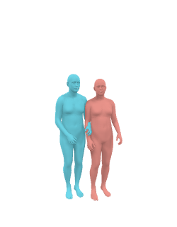
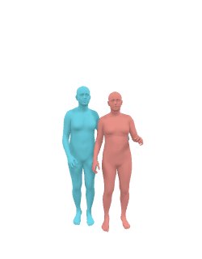
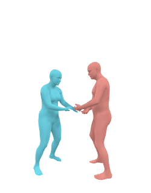
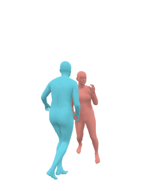
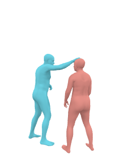
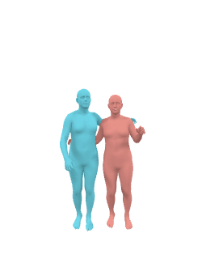
</p>

Unconditional generation stating from random noise using different sampling schedules

```
# custom schedule, with larger steps in the beginning and more fine grained steps towards the end.
python llib/methods/hhc_diffusion/evaluation/sample.py --exp-cfg essentials/buddi/config_v01.yaml --checkpoint-name essentials/buddi/buddi_checkpoint_v01.pt --output-folder demo/buddi/buddi_checkpoint_v01/sample --max-images-render=100 --num-samples 100 --max-t -2 --save-vis

# custom schedule. This is faster and gives more variety, but also more intersections etc.
python llib/methods/hhc_diffusion/evaluation/sample.py --exp-cfg essentials/buddi/config_v01.yaml --checkpoint-name essentials/buddi/buddi_checkpoint_v01.pt --output-folder demo/buddi/buddi_checkpoint_v01/sample --max-images-render=100 --num-samples 100 --max-t -1 --save-vis

# linear schedule starting from max-t and skipping every skip-steps step. Here, it's 1000 990 980 ... 20 10. 
python llib/methods/hhc_diffusion/evaluation/sample.py --exp-cfg essentials/buddi/config_v01.yaml --checkpoint-name essentials/buddi/buddi_checkpoint_v01.pt --output-folder demo/buddi/buddi_checkpoint_v01/sample --max-images-render=100 --num-samples 100 --max-t 1000 --skip-steps 10 --save-vis
```


#### Walk through latent space


<p style="display:flex">
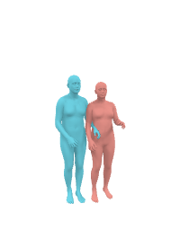
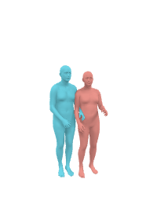
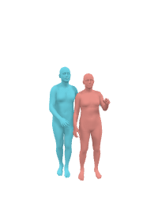
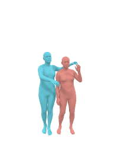
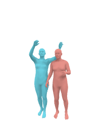
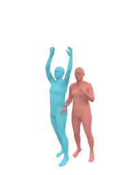
</p>

Sample two interacting meshes from buddi and walk the latent space between them. To do this, we linerly interpolate their latent vectors at t=51 and denoise the latens.

```
python llib/methods/hhc_diffusion/evaluation/walk_latent_space.py --exp-cfg essentials/buddi/config_v01.yaml --max-t -1 --checkpoint-name essentials/buddi/buddi_checkpoint_v01.pt --output-folder demo/buddi/buddi_checkpoint_v01/latent_walk
```

### SMPLify-X2P

#### Optimization with BUDDI

- Run optimization using BUDDI as prior for how people interact via an SDS loss. This approach does not require contact maps.
    
    <p style="display:flex">
    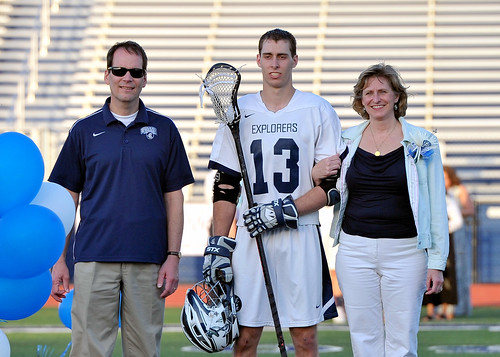
    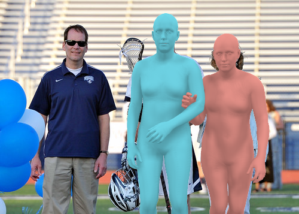
    
    </p>
    <p style="display:flex">
    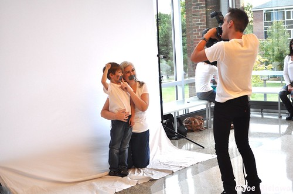
    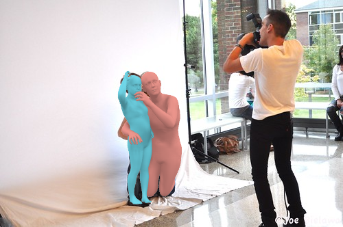
    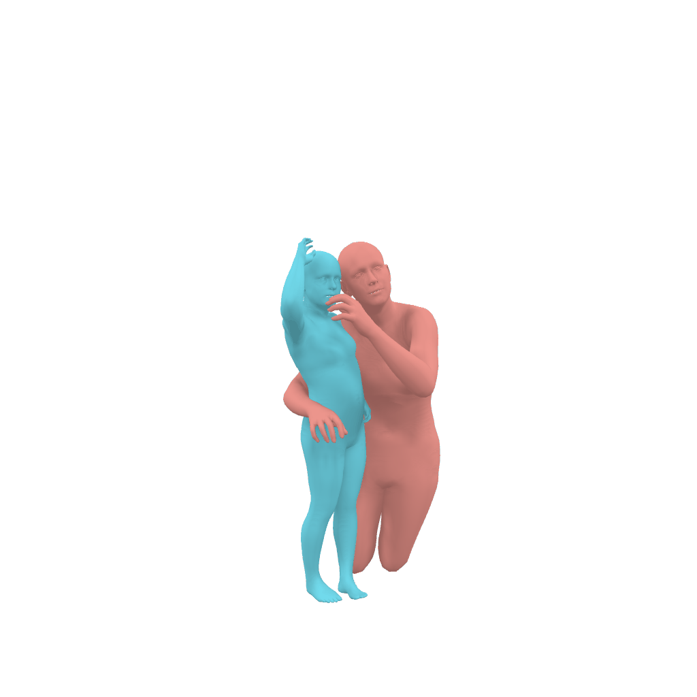
    </p>
   
    ```
    # run optimization with buddi prior
    python llib/methods/hhcs_optimization/main.py --exp-cfg llib/methods/hhcs_optimization/configs/demo_buddi.yaml
    ```

- Run optimization with BUDDI on FlickrCI3D. First follow the data and isntall instructions, then run the commands below. You can use --cluster_pid and --cluster_bs flags to process only a few images or distribute batches of data on a cluster.
    ```
    # run optimization for training split
    python llib/methods/hhcs_optimization/main.py --exp-cfg llib/methods/hhcs_optimization/configs/demo_buddi.yaml \
    --exp-opts logging.run=fit_pseudogt_flickrci3ds_train_v02 datasets.train_names=['flickrci3ds'] datasets.train_composition=[1.0] datasets.test_names=[]

    # run optimization for validation split
    python llib/methods/hhcs_optimization/main.py --exp-cfg llib/methods/hhcs_optimization/configs/demo_buddi.yaml \
    --exp-opts logging.run=fit_pseudogt_flickrci3ds_train_v02 datasets.val_names=['flickrci3ds'] datasets.test_names=[]

    # run optimization for test split
    python llib/methods/hhcs_optimization/main.py --exp-cfg llib/methods/hhcs_optimization/configs/demo_buddi.yaml \
    --exp-opts logging.run=fit_pseudogt_flickrci3ds_train_v02 datasets.test_names=['flickrci3ds']
    ```

#### Optimization with ground-truth contact maps

- Run optimization with ground-truth contact maps to create pseudo ground-truth fits for FlickrCI3D. This is how we create the pseudo-ground truth data which we use to train BUDDI.   
    <p style="display:flex">
    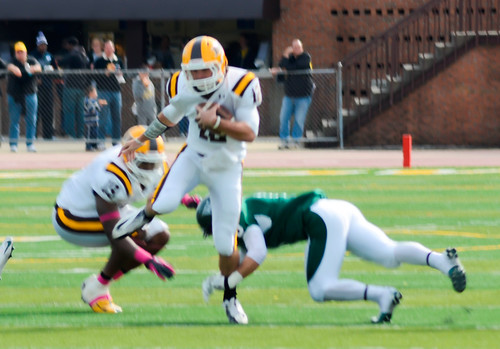
    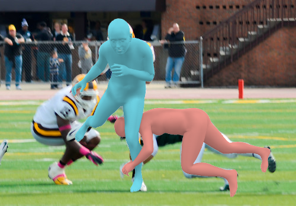
    
    </p>
    <p style="display:flex">
    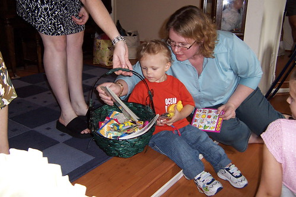
    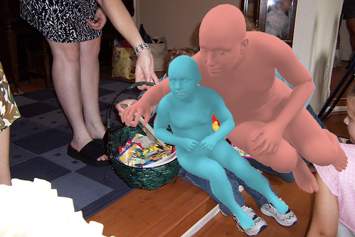
    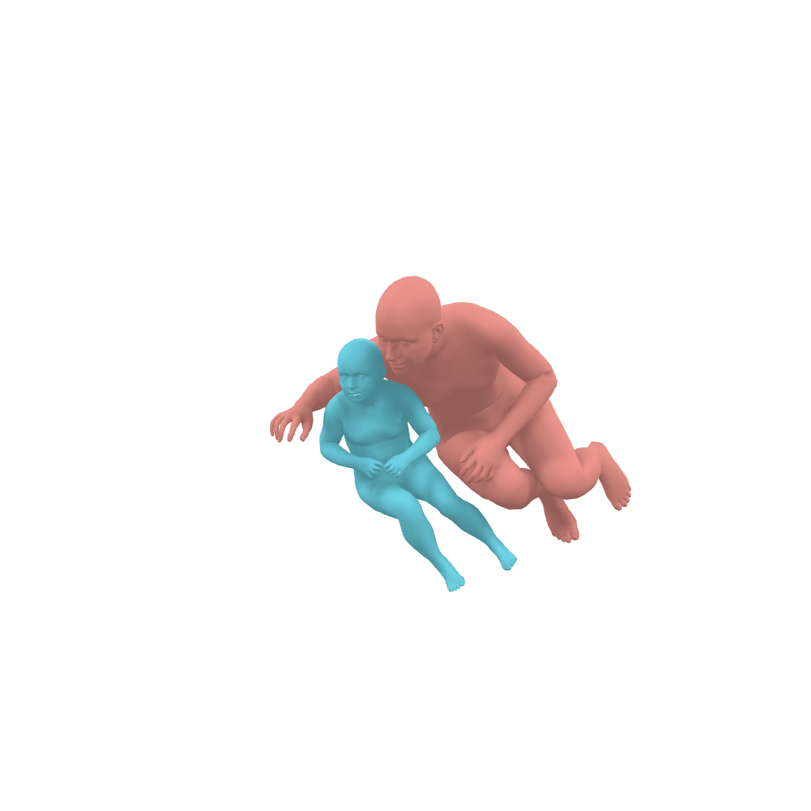
    </p>

    ```
    # run optimization with ground-truth contact map
    python llib/methods/hhcs_optimization/main.py --exp-cfg llib/methods/hhcs_optimization/configs/demo_pgt.yaml 
    ```

- Create FlickrCI3D PGT data. First follow the data and isntall instructions, then run the commands below. You can use --cluster_pid and --cluster_bs flags to process only a few images or distribute batches of data on a cluster.
    ```
    # run optimization for training split
    python llib/methods/hhcs_optimization/main.py --exp-cfg llib/methods/hhcs_optimization/configs/demo_pgt.yaml \
    --exp-opts logging.run=fit_pseudogt_flickrci3ds_train_v02 datasets.train_names=['flickrci3ds'] datasets.train_composition=[1.0] datasets.test_names=[]

    # run optimization for validation split
    python llib/methods/hhcs_optimization/main.py --exp-cfg llib/methods/hhcs_optimization/configs/demo_pgt.yaml \
    --exp-opts logging.run=fit_pseudogt_flickrci3ds_train_v02 datasets.val_names=['flickrci3ds'] datasets.test_names=[]

    # run optimization for test split
    python llib/methods/hhcs_optimization/main.py --exp-cfg llib/methods/hhcs_optimization/configs/demo_pgt.yaml \
    --exp-opts logging.run=fit_pseudogt_flickrci3ds_train_v02 datasets.test_names=['flickrci3ds']
    ```

## Training

### BUDDI Training
Follow the data download and processing steps in [Dataset](./documentation/DATA.md). Then run: 
```
python llib/methods/hhc_diffusion/main.py --exp-cfg llib/methods/hhc_diffusion/configs/config_buddi_v01.yaml --exp-opts logging.run=demo_buddi_v01
```


## Evaluation 

We evaluate BUDDI against pseudo-ground truth fits and ground-truth contact labels of FlickrCI3D.
```
# pcc of  pseudo ground-truth
python flickrci3ds_val_pgt.py --exp-cfg eval_flickrci3ds.yaml -gt datasets/processed/FlickrCI3D_Signatures/fit_pseudogt_flickrci3ds_test -p <RES_ROOT>/fit_pseudogt_flickrci3ds_test --flickrci3ds-split test

# baseline against pseudo ground-truth
python flickrci3ds_val_pgt.py --exp-cfg eval_flickrci3ds.yaml -gt datasets/processed/FlickrCI3D_Signatures/fit_pseudogt_flickrci3ds_test -p <RES_ROOT>/fit_baseline_flickrci3ds_test --flickrci3ds-split test

# ours against pseudo ground-truth
python flickrci3ds_val_pgt.py --exp-cfg eval_flickrci3ds.yaml -gt datasets/processed/FlickrCI3D_Signatures/fit_pseudogt_flickrci3ds_test -p <RES_ROOT>/fit_diffprior_flickrci3ds_test --flickrci3ds-split test
```

## Acknowledgments
We thank our colleagues for their feedback, in particular, we thank Aleksander Holynski, Ethan Weber, and Frederik Warburg for their discussions about diffusion and the SDS loss, Jathushan Rajasegaran, Karttikeya Mangalam and Nikos Athanasiou for their discussion about transformers, and Alpar Cseke, Taylor McConnell and Tsvetelina Alexiadis for running the user study.

Previous work on human pose and shape estimation has made this project possible: we use [BEV](https://github.com/Arthur151/ROMP) to initialize the optimization method, the Flickr and mocap data provided in [Close interactions 3D](https://ci3d.imar.ro/index.php/). We also use previous workon diffusion models and their code bases, [diffusion](https://github.com/hojonathanho/diffusion) and [guided-diffusion](https://github.com/openai/guided-diffusion/tree/main/guided_diffusion).


## Citation
```
@inproceedings{mueller2023buddi,
  title = {Generative Proxemics: A Prior for 3D Social Interaction from Images},
  author = {M{\”u}ller, Lea and Ye, Vickie, and Pavlakos, Georgios and Black, Michael J. and Kanazawa, Angjoo},
  booktitle = {arXiv preprint},
  year = {2023},
}
```

## License
See [License](./LICENSE).


## Disclosure
MJB has received research gift funds from Adobe, Intel, Nvidia, Meta/Facebook, and Amazon. MJB has financial interests in Amazon, Datagen Technologies, and Meshcapade GmbH. While MJB is a part-time employee of Meshcapade, his research was performed solely at, and funded solely by, the Max Planck Society.


## Contact
Please contact lea.mueller@tuebingen.mpg.de for technical questions.